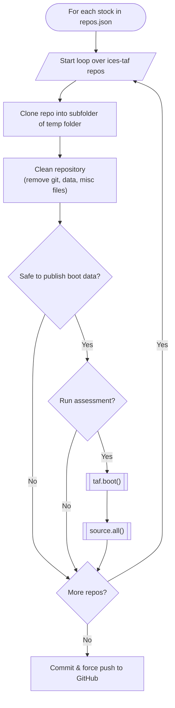
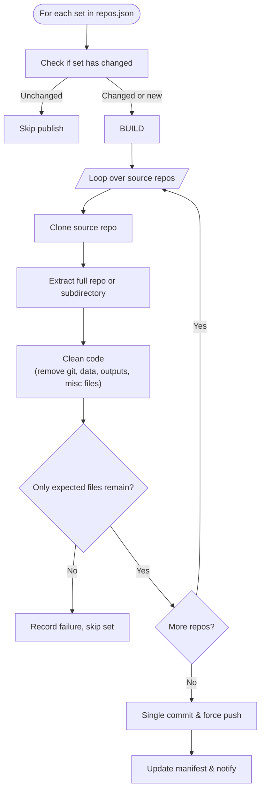

# Psublish advice code workflow

## Publishing Stocks on ices-advice

When publishing a stock to the `ices-advice` github organisation, the github workflow does the following for each stock listed in `repos.json`



An example repos.json file is below:

You can optionally have your TAF folder in a subdirectory of the source repo
and this can be done by setting the `subdir` feild element of the repos array to something appropriate, `"subdir": "my_assessment"` for example. Another option is to set `"safe": "true"` which is interpreted as meaning your `boot/initial/data` folder is safe to publish for that repo. Unfortunately the `"run"` feild is forced to `false` currently.

```json
[
  {
    "repo_name": "2026_her.27.6aS7bc",
    "publish_after_utc": "2026-04-30 10:00",
    "repos": [
      {
        "name": "2026_her.27.6aS7bc_assessment"
      }
    ]
  },
  {
    "repo_name": "2026_her.27.irls",
    "publish_after_utc": "2026-04-30 10:00",
    "repos": [
      {
        "name": "2026_her.27.irls_assessment",
        "run": false,
        "safe": true,
        "subdir": "taf_code"
      }
    ]
  }
]
```


# Publish Advice Code Workflow

(AI generated documentation base on yml file, and my previous chats with it)

Some things it says are not true! For example: in the adding a new stock section, nothing is created automatically (yet!)

## Overview

This repository contains GitHub Actions workflows used to **publish advisory assessment code** from source repositories (typically in `ices-taf`) into **registry repositories** in the `ices-advice` organisation.

The workflows are designed to support:

- reproducible publication,
- transparent provenance,
- controlled release timing,
- governance-safe cleaning of sensitive or generated content.

The primary workflow documented here is:

> **Publish repositories to registry**

This workflow aggregates one or more source repositories per stock, cleans them according to ICES TAF conventions, and publishes a **single-commit snapshot** to a target repository.

---

## Publishing Stocks to `ices-advice`

When publishing advice code for a stock to the `ices-advice` GitHub organisation, the workflow processes each **set** listed in `repos.json`.

At a high level, the workflow:

1. Detects whether the source repositories have changed since the last publication.
2. If changes are detected, rebuilds the registry repository from scratch.
3. Cleans the contents to remove generated data, intermediate artefacts, and non-source files.
4. Force-pushes a single reproducible commit to the target repository.
5. Records provenance (exact commit SHAs) and reports results.

---

## High-level Workflow Logic



---

## Input File: `repos.json`

The workflow is driven entirely by `repos.json`, which is a **top-level JSON array**. Each element defines one registry repository (referred to as a *set*).

### Example

```json
[
  {
    "repo_name": "2026_her.27.6aS7bc",
    "publish_after_utc": "2026-04-30 10:00",
    "repos": [
      {
        "name": "2026_her.27.6aS7bc_assessment"
      }
    ]
  }
]
```

### Set-level fields

| Field | Description |
|-----|------------|
| `repo_name` | Name of the target registry repository |
| `publish_after_utc` | Date/time after which the repository may become public |
| `org_source` | *(Optional)* Source organisation (defaults to workflow input) |
| `org_target` | *(Optional)* Target organisation (defaults to workflow input) |
| `repos` | Array of source repositories contributing to this set |

### Repo-level fields

| Field | Description |
|-----|------------|
| `name` | Source repository name |
| `subdir` | *(Optional)* Subdirectory containing the TAF code |
| `safe` | If `true`, permits publication of certain boot artefacts |

⚠️ The `run` field is currently **ignored**. Assessments are **not executed** by this workflow; it only publishes code.

---

## Change Detection and Reproducibility

To ensure reproducibility and avoid unnecessary churn:

- The workflow maintains a `published_commits.json` manifest at the root of the calling repository.
- For each set, it records the exact commit SHA of every source repository that was published.
- On subsequent runs:
  - If **all SHAs match**, the set is skipped.
  - If **any SHA differs** (or the set is missing), the set is republished.

This guarantees that every registry snapshot corresponds to a **well-defined, auditable state of the source repositories**.

---

## Cleaning and Content Policy

Before publication, each extracted source repository is cleaned aggressively.

### Boot and Bootstrap directories

- `boot/` and `bootstrap/` directories are retained **only** at the top level.
- Within them:
  - Only `*.R` and `*.bib` files are kept.
  - All subdirectories and other files are removed.

### Repository root

✅ **Allowed files**

- `.R`, `.Rmd`, `.Rnw`, `.qmd`
- `.md`
- `.tex`
- `.bib`
- `LICENSE` / `LICENCE`

❌ **Removed**

- All other files
- All other directories
- All dotfiles (including `.gitignore`, `.github`, editor artefacts)

### Validation

After cleaning, the workflow verifies that **no unexpected directories remain** aside from `boot/` and `bootstrap`.

- If unexpected directories are found:
  - The set is **skipped**
  - The failure is recorded
  - The workflow continues with the next set

This “fail-soft per set” behaviour prevents partial publication while keeping the overall run robust.

---

## Registry Publication Model

Each set is published as:

- a **fresh Git repository**
- a **single commit**
- a **force-push** to `main`

There is **no retained history** in the registry repositories.

This ensures:

- deterministic builds,
- no accidental leakage of historical artefacts,
- simple provenance and auditing.

---

## Reusable Workflow Interface

The workflow is implemented using `workflow_call` and accepts the following inputs:

| Input | Description | Default |
|-----|------------|---------|
| `source_org` | Default organisation for source repositories | `ices-taf` |
| `target_org` | Default organisation for registry repositories | `ices-advice` |

### Required secrets

| Secret | Purpose |
|------|--------|
| `CROSS_ORG_TOKEN` | GitHub token with read/write access across organisations |
| `TEAMS_WEBHOOK_URL` | *(Optional)* Microsoft Teams webhook for notifications |

---

## How to Add a Stock

To add a new stock for publication:

1. **Create or identify the source repository** in the source organisation (typically `ices-taf`).
   - Ensure it follows TAF conventions.
   - Ensure no sensitive or embargoed data is committed.

2. **Edit `repos.json`** in the calling repository.
   - Add a new object to the top-level array.

3. **Define the target registry repository name** using `repo_name`.
   - This repository will be created automatically if it does not exist.

4. **Set the release date** using `publish_after_utc`.
   - This must be in UTC and determines when the repository becomes public.

5. **Add source repositories** under `repos`.
   - Each entry must specify `name`.
   - Use `subdir` if the TAF code lives in a subfolder.
   - Set `safe: true` only if boot artefacts are safe to publish.

6. **Commit and push `repos.json`.**
   - On the next workflow run, the new stock will be evaluated and published if eligible.

### Minimal example

```json
{
  "repo_name": "2026_spr.27.7de",
  "publish_after_utc": "2026-05-15 10:00",
  "repos": [
    {
      "name": "2026_spr.27.7de_assessment"
    }
  ]
}
```

---

## Notifications (Microsoft Teams)

If a Teams webhook URL is provided, the workflow posts a summary message including:

- ✅ Sets that were published or republished
- ⚠️ Sets that were skipped due to cleaning errors

Notifications are **suppressed automatically** if:

- no sets were published,
- no failures occurred, or
- no webhook URL is configured.

---

## Intended Use and Guarantees

This workflow is intended for:

- publishing ICES advice code,
- supporting reproducible assessments,
- enforcing governance and release discipline.

**It guarantees that:**

- published repositories are clean, source-only snapshots,
- publication is traceable to exact upstream commits,
- accidental or early publication is avoided,
- operational failures do not silently succeed.
