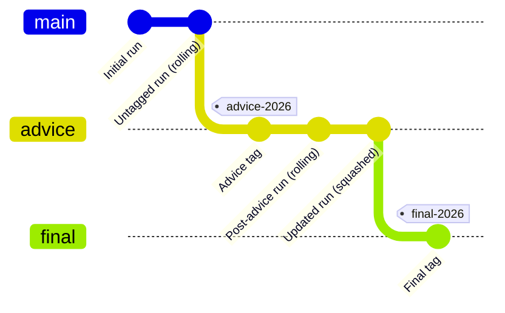

# TAF Results Branch Model

This workflow implements a structured and governed approach to publishing
Transparent Assessment Framework (TAF) results using a dedicated **`taf`**
branch.

The model is designed to balance:

- scientific reproducibility
- operational efficiency
- clean version history
- auditability for review and advice tracking

---

## Overview

- **`main` / `master`**
  Contains the analytical intent: code, inputs, and configuration.

- **`taf`**
  Contains the code *and* generated results (data, model outputs, reports) and
  machine‑readable metadata describing how those results were produced.

The `taf` branch is **fully automated** and **never edited manually**.

---

## Key principles

1. **Semantic tagging**
   - Results are tagged **only when explicitly requested**:
     - `--tag-advice`
     - `--tag-final`
   - Tags represent **official analytical milestones**.

2. **Rolling untagged results**
   - Between tags, the `taf` branch contains **a single rolling commit**
     representing the most recent run.
   - Intermediate runs do *not* accumulate history noise.

3. **Explicit provenance**
   - Each run writes a `taf-metadata.json` file describing:
     - input hashes
     - reuse decisions
     - squash behaviour
     - software versions
     - triggering commit and context

4. **Controlled history rewriting**
   - History is squashed **only on the generated `taf` branch**.
   - Tagged commits are never rewritten.

---

## TAF history evolution

The following diagram shows how the `taf` branch evolves over time.

### How to read this

- **Tagged commits** (`advice-*`, `final-*`) are **stable records**.
- **Untagged commits** between tags are **continually replaced**.
- At any point, the `taf` branch contains:
  - all tagged milestones
  - at most **one** untagged working commit

---

## Boot reuse and efficiency

TAF bootstrapping (`taf.boot()`) is treated as a *deterministic transformation*.

- A content hash is computed from:
  - `boot/DATA.bib`
  - `boot/*.R`
  - `boot/initial/data/**`
- If this hash matches the previous run:
  - `boot/data/**` is reused from the previous `taf` commit
- If not:
  - bootstrapping is re-run

This avoids unnecessary recomputation **without hiding state**.
Reuse decisions are always recorded in metadata.

---

## Escape hatches

Advanced users may control behaviour via commit messages:

| Flag | Effect |
|-----|-------|
| `--no-taf` | Skip TAF execution entirely |
| `--force-boot` | Force re-run of `taf.boot()` |
| `--tag-advice` | Create an advice milestone tag |
| `--tag-final` | Create a final advice tag |
| `--no-squash` | Disable squashing for this run |

These are explicitly recorded in `taf-metadata.json`.

---

## Policy note for ICES users

### What this means for review and advice processes

- The `taf` branch represents **published analytical reality**, not development history.
- Each tagged commit corresponds to a **reviewable assessment state**.
- Untagged commits are an implementation detail and should not be cited or archived.

### Why history is intentionally rewritten

- Generated results change frequently during development.
- Retaining every intermediate state would:
  - obscure important milestones
  - complicate review
  - create unnecessary storage and governance burden

By squashing untagged commits, the `taf` branch remains:

- concise
- interpretable
- aligned with ICES advice and reporting cycles

### Reproducibility guarantee

Although history is compacted:

- all analytical inputs are versioned on `main`
- all results are reproducible from tagged states
- metadata provides complete provenance for every run

This model conforms with ICES principles of transparency while remaining
operationally practical for modern continuous integration workflows.

---

## Summary

> **Tags are records.
> Untagged commits are working state.
> Metadata explains everything.**

This approach ensures that TAF results are:
- reproducible
- auditable
- efficient
- and easy to interpret by both analysts and reviewers.
